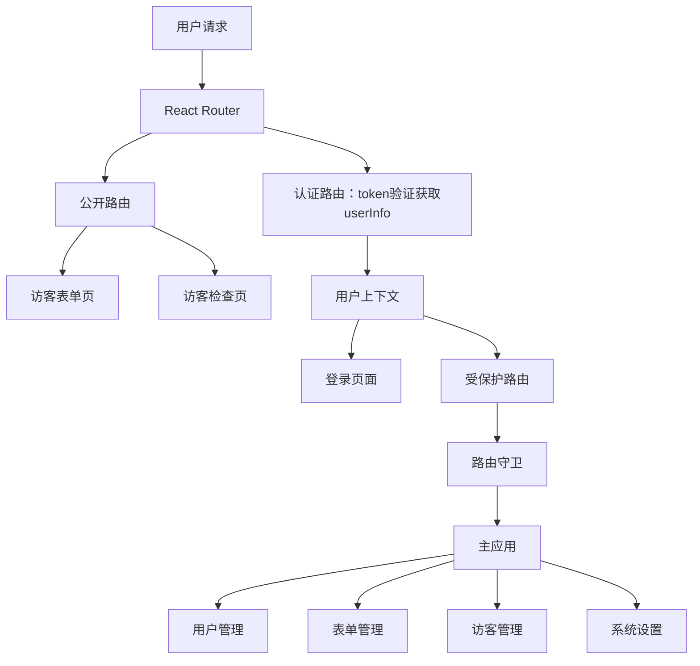

# 系统架构图

## 系统路由架构

```mermaid
graph TD
    Client[用户请求] --> Router[React Router]
    Router --> Public[公开路由]
    Router --> Auth[认证路由：token验证获取userInfo]
    
    Public --> VisitorForm[访客表单页]
    Public --> VisitorCheck[访客检查页]
    
    Auth --> UserProvider[用户上下文]
    UserProvider --> Login[登录页面]
    UserProvider --> Protected[受保护路由]
    
    Protected --> Guard[路由守卫]
    Guard --> MainApp[主应用]
    
    MainApp --> Users[用户管理]
    MainApp --> Forms[表单管理]
    MainApp --> Visitors[访客管理]
    MainApp --> Settings[系统设置]

```

    